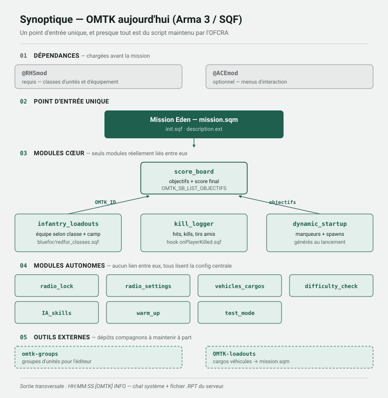
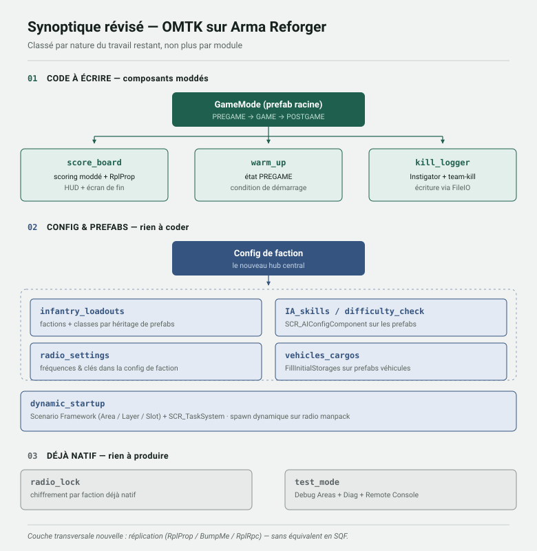

# Vers REFORGER

Travaux préparatoires à la migration d'OMTK (OFCRA Mission ToolKit) d'Arma 3 vers Arma Reforger.

> **État : en construction active.** Quatre modules (`kill_logger`, `score_board`, `warm_up`, `IA_skills`) sont construits et testés en jeu ; `ui` (panneau admin) est en cours, une première brique construite. Le reste du dépôt est de l'analyse documentaire, pas encore vérifiée en Workbench. Voir [Fiabilité](#fiabilité) avant de vous appuyer sur un détail technique, et [Ce qui reste à faire](#ce-qui-reste-à-faire) pour l'état complet, module par module.

---

## Le préalable : le nombre de joueurs

À trancher avant tout le reste, y compris avant d'écrire une ligne de code.

L'OFCRA réunit couramment **100 à 130 joueurs** par session publique, avec des pics historiques au-delà de 200. Or Arma Reforger **plafonne à 128 joueurs** par configuration serveur, la plupart des scénarios étant calibrés pour 32 à 64. Les retours de la communauté décrivent des serveurs à 128 déjà en difficulté, le moteur répliquant l'ensemble de l'état de jeu — joueurs, véhicules, structures, projectiles.

À cela s'ajoute que l'optimisation courante consistant à désactiver l'IA côté serveur pour libérer du CPU n'est pas utilisable telle quelle : l'OFCRA emploie de l'IA non combattante (civils, otages) sur certaines missions. L'impact reste faible vu les volumes en jeu, mais la marge n'est pas là.

**Aucun portage de module ne résout ce problème.** Tant qu'il n'est pas tranché, le reste de ce dépôt décrit comment migrer OMTK, pas si la migration est jouable pour un format à 100+ joueurs. Les pistes à explorer : mesurer le comportement réel d'un serveur modé à cette échelle, envisager des formats à effectifs réduits, ou attendre les évolutions du moteur.

---

## Le constat de départ

Ce n'est pas un portage, c'est une réécriture. Le SQF n'existe pas sous Enfusion, `@RHSmod` y devient
RHS: Status Quo — un mod distinct, plus jeune et au catalogue bien plus restreint (voir « À définir ») —,
et l'éditeur Eden est remplacé par le World Editor. Ce qui survit, c'est le **découpage fonctionnel**
d'OMTK — pas son code.

Trois particularités de l'OFCRA orientent tout ce qui suit, et ne correspondent pas aux usages
pour lesquels Reforger est documenté : **aucun respawn**, **aucune IA combattante** (seulement
des civils et otages, occasionnellement), et une **mission inédite chaque semaine** plutôt qu'un
mode de jeu persistant. Les récapitulatifs signalent au cas par cas ce que ça rend sans objet.

### OMTK aujourd'hui

Un point d'entrée unique (`init.sqf` / `description.ext`), deux dépendances externes, et onze modules
dont presque tous sont du script maintenu par l'OFCRA.

### Ce que ça deviendrait sur Reforger

Le code couleur est le même sur les deux schémas : vert = code maintenu par l'OFCRA, gris = fourni
par le moteur ou un tiers. La comparaison est le résultat principal de cette analyse — seuls **trois
modules sur onze** demandent réellement d'écrire du code.

### Index des modules

| Module OMTK | Nature du travail sur Reforger | Statut | Analyse |
|---|---|---|---|
| `score_board` | Code — scoring moddé, réplication, HUD, écran de fin | **Testé en jeu** | [Récapitulatif](docs/OMTK_ScoreBoard_Reforger_Recap.md) |
| `warm_up` | Code — minuteur autonome, zones par faction, invulnérabilité, trigger admin, véhicules, IA | **Testé en jeu** | [Récapitulatif](docs/OMTK_WarmUp_Reforger_Recap.md) |
| `kill_logger` | Code — Instigator + écriture FileIO | **Testé en jeu** | [Récapitulatif](docs/OMTK_KillLogger_Reforger_Recap.md) |
| `infantry_loadouts` | Config — factions et classes par héritage de prefabs | **Abandonné** — pas nécessaire, RHS fournit déjà les factions | [Récapitulatif](docs/OMTK_Loadouts_Reforger_Recap.md) |
| `dynamic_startup` | Config — Scenario Framework + `SCR_Task` | **Pas un module toolkit** — à la charge du créateur de mission chaque semaine, via le World Editor natif | [Récapitulatif](docs/OMTK_DynamicStartup_Reforger_Recap.md) |
| `vehicles_cargos` | Config — bridage des véhicules (chargement initial à la charge du créateur de mission) | Doc seulement, rien construit — portée réduite | [Récapitulatif](docs/OMTK_VehiclesCargos_Reforger_Recap.md) |
| `difficulty_check` · `IA_skills` | Config — `SCR_AIConfigComponent`, IA d'objectif uniquement (pas de combattante d'appoint) | **Testé en jeu** | [Récapitulatif](docs/OMTK_IASkills_Reforger_Recap.md) |
| `radio_settings` | Config — fréquences et clés dans la config de faction | Doc seulement, rien vérifié en jeu | [Récapitulatif](docs/OMTK_Radio_Reforger_Recap.md) |
| `radio_lock` | Déjà natif — chiffrement par faction au spawn | Doc seulement, rien vérifié en jeu | [Récapitulatif](docs/OMTK_Radio_Reforger_Recap.md) |
| `test_mode` | Déjà natif — Debug Areas, exécutables Diag, Remote Console | Doc seulement, procédure à écrire | [Récapitulatif](docs/OMTK_TestMode_Reforger_Recap.md) |
| `ui` (panneau admin) | À déterminer — probablement en grande partie remplacé par Game Master natif | **En cours** — bouton End Warm-up construit (compilé, visibilité admin non testable hors serveur réel) | [Récapitulatif](docs/OMTK_UI_AdminPanel_Reforger_Recap.md) |
| Mode spectateur | À déterminer — dépendance externe (GRAD Spectator) ou réimplémentation | Doc seulement, décision à prendre avec l'OFCRA | [Récapitulatif](docs/OMTK_SpectatorMode_Reforger_Recap.md) |

Les outils compagnons disparaissent : `omtk-groups` devient de l'héritage de prefabs, `OMTK-loadouts`
devient `FillInitialStorages`. Plus rien à maintenir à côté du mod.

**Modules du dépôt OMTK jamais audités**, repérés en listant l'ensemble du dépôt source (voir
récapitulatif `ui`, §7) : `respawn_mode`, `view_distance`, `zeus_admins`, `rambo_warn`,
`uniform_lock`, `tactical_paradrop`, `vehicles_thermalimaging`, `map_exploration`, `3rd-parties`.
Plusieurs recoupent probablement déjà des modules documentés (voir tableau ci-dessus et récap `ui`,
§4.3 et §7) — à examiner avant de considérer l'audit terminé.

**Mode spectateur** — découvert séparément, absent de la liste ci-dessus car il n'a pas son propre
dossier `omtk/<module>/` : câblé directement dans les scripts racine de la mission
(`description.ext`, `onPlayerKilled.sqf`, `onPlayerRespawn.sqf`), avec son propre paramètre
`OMTK_MODULE_SPECTATOR` (all/team), via l'addon tiers **EG Spectator Mode**. Directement lié à la
règle « aucun respawn » de l'OFCRA. Spec confirmée : caméra libre façon « mouette » OFP, pas une
possession d'IA — voir son [récapitulatif dédié](docs/OMTK_SpectatorMode_Reforger_Recap.md) pour
le détail et la décision à trancher (dépendance à GRAD Spectator vs réimplémentation).

---

## Feuille de route

| # | Étape | État |
|---|---|---|
| 1 | Prise en main du Workbench (installation, tutoriels, samples officiels) | **fait** — Workbench installé, `SampleMod_ModdedScript` compilé et testé en jeu |
| 2 | Audit de l'existant et correspondance avec les systèmes natifs | **fait** — ce dépôt (voir aussi modules non audités ci-dessus) |
| 3 | Prototype minimal d'un module simple, testé de bout en bout | **fait** — `kill_logger` (morts, dégâts, positions, véhicules, connexions, journal structuré) |
| 4 | Construction module par module, dans l'ordre des dépendances | **en cours** — 3 des 11 modules construits et testés en jeu (`kill_logger`, `score_board`, `warm_up`) ; `infantry_loadouts` et `dynamic_startup` pas nécessaires ; les 6 autres restent à construire, certains à portée réduite — voir [Ce qui reste à faire](#ce-qui-reste-à-faire) |
| 5 | Assemblage dans un `GameMode` et mission-modèle réutilisable | à faire — un GameMode de test fonctionnel existe, à reconstruire proprement sur une base `GameModeSF` héritée, sans les résidus de test (voir récap `warm_up`, §6) |
| 6 | Test en conditions réelles avec des membres de l'OFCRA | à faire |
| 7 | Documentation de chaque composant pour permettre la contribution | à faire |

Le détail de ce qui a été validé en pratique (noms de classes/méthodes confirmés par compilation,
procédure World Editor, historique des corrections) est dans les récapitulatifs
[`kill_logger`](docs/OMTK_KillLogger_Reforger_Recap.md), [`score_board`](docs/OMTK_ScoreBoard_Reforger_Recap.md)
et [`warm_up`](docs/OMTK_WarmUp_Reforger_Recap.md), section par section.

Une remarque sur l'ordre, toujours valable : la **réplication** (`RplProp` / `BumpMe` / `RplRpc`)
n'a aucun équivalent en SQF et conditionne la façon d'écrire chaque composant multijoueur — c'est
d'ailleurs ce qui explique une partie des détours rencontrés en construisant `score_board` et
`warm_up` (abonnements dupliqués à un événement statique, événements marqués obsolètes dans le
moteur, pièges de configuration d'entités — voir les récapitulatifs correspondants).

**Une règle apprise à la dure, valable pour tout le reste du projet** : un monde Reforger ne
tolère **qu'un seul** `SCR_BaseGameMode` actif — c'est documenté comme obligatoire côté moteur,
pas une simple bonne pratique. En avoir deux, même avec l'un désactivé via sa case "Disabled",
casse le démarrage de la partie de façon peu lisible (écran noir, doublons de tous les
gestionnaires de faction/loadout/radio). Seule la suppression pure et simple du GameMode en
trop résout le problème.

---

## Ce qui reste à faire

### Modules construits et testés — réserves restantes

**`warm_up`** — zones de confinement, téléportation sans mort, invulnérabilité, minuteur global,
**et les trois points suivants tous validés en jeu cette session** : trigger admin de fin de
warm-up, véhicules immobilisés (blocage moteur), IA en zone invulnérables. Détail complet des
correctifs (flags `QueryEntitiesBySphere`, `ChimeraCharacter`, `SetCanMove` écarté au profit du
blocage moteur, etc.) dans le récapitulatif. Restent ouverts :
- tester la **vraie liste d'admins** sur un serveur dédié/hébergé réel (config.json avec un ID
  Reforger dans `game.admins`) — seul le rejet "pas admin" a été exercé, pas la confirmation
- retirer le bouton de test (`OMTK_TEST_AdminEndWarmupAction.c`) une fois ce test fait
- ~~trancher le doublon d'invulnérabilité~~ — **fait : `OMTK_WarmupInvulnerability.c` supprimé**,
  branchement `OnGameStateChanged` retiré d'`OMTK_ObjectiveScoreLink.c`
- ~~décider du sort d'`OMTK_ReadyAction.c`~~ — **fait : supprimé** (code mort, jamais câblé, pointait vers l'ancien système `CanAdvanceState`)
- ~~`OMTK_WarmUpComponent.c` (dernier résidu du système `CanAdvanceState`)~~ — **fait : supprimé du projet**, plus rien ne l'appelait depuis la suppression d'`OMTK_ReadyAction.c`
- nettoyage des brouillons obsolètes dans `docs/drafts/` (`OMTK_ReadyAction_DRAFT.c`,
  `OMTK_WarmUpComponent_DRAFT.c` — approche `CanAdvanceState` abandonnée)

**Hors périmètre, confirmé** : l'assignation de faction pré-déterminée n'est pas un sujet Reforger
— les camps sont décidés à la création de mission, les joueurs se slotent eux-mêmes à leur place
convenue, les admins font la police. Aucun mécanisme à construire.

**`score_board`** — score par joueur/faction et déclenchement par tâche du Scenario Framework
confirmés en jeu. Rien de bloquant identifié à ce jour au-delà des points listés dans son récapitulatif.

**`kill_logger`** — chaîne complète testée en jeu. Rien de bloquant identifié.

### Modules pas nécessaires (retirés de la liste)

- **`dynamic_startup`** — pas un module toolkit : la mise en place Area/Layer/Slot se fait à la
  main par le créateur de mission, chaque semaine, directement dans le World Editor
- **`infantry_loadouts`** — abandonné, l'OFCRA n'en a pas besoin (RHS: Status Quo fournit déjà les
  factions AFRF/USAF)

### Modules jamais construits (doc théorique seulement)

- ~~**`IA_skills` / `difficulty_check`**~~ — **fait, testé en jeu** : `SCR_AIConfigComponent`, 4 cases
  à décocher (Danger Events, Perception, Attack, Take Cover), confirmé en jeu. Le volet `ia_manager`
  (IA combattante d'appoint) reste hors périmètre.
- **`radio_lock` / `radio_settings`** — vérifier en jeu le chiffrement par faction natif ; **ajouter
  un module d'effacement/reset de radio** — si une radio est perdue au profit de l'ennemi, la squad
  qui l'a perdue doit pouvoir la vider à distance (bouton ou autre) pour empêcher l'ennemi de
  l'exploiter malgré le chiffrement. À garder sous le coude, surtout si ça demande du travail —
  pas prioritaire.
- **`vehicles_cargos`** — le chargement initial (`FillInitialStorages`) est à la charge du créateur
  de mission, pas un besoin toolkit. En revanche, il faut une **capacité de bridage des véhicules**
  (détail à définir avec l'OFCRA — cohérente avec l'immobilisation en warm-up ci-dessus, probablement
  plus large).
- **`test_mode`** — pas un module à coder : écrire la procédure de test standard (Debug Areas,
  exécutables Diag, Remote Console) une fois éprouvée en conditions réelles
- **`ui` (panneau admin)** — permissions résolues (`SCR_PlayerListedAdminManagerComponent`, voir
  `warm_up`) ; bouton End Warm-up construit et compilé. Reste : vérifier ce que couvre déjà Game
  Master nativement avant d'écrire d'autres widgets custom ; construire un vrai panneau (Widgets)
  pour les boutons restants (téléportation, soin, bascules collectives, export AAR) ; trancher le
  sort de "Fix uniform Bug" (probablement obsolète) et du raccourci distance d'affichage

### Modules jamais audités

`respawn_mode`, `view_distance`, `zeus_admins`, `rambo_warn`, `uniform_lock`, `tactical_paradrop`,
`vehicles_thermalimaging`, `map_exploration`, `3rd-parties` — à confronter au dépôt source OMTK
avant de considérer l'audit terminé. S'y ajoute le **mode spectateur** (`OMTK_MODULE_SPECTATOR`,
addon tiers EG Spectator Mode) — hors de la structure habituelle des dossiers `omtk/`, découvert
séparément, directement lié à la règle « aucun respawn » de l'OFCRA.

### Nouvelles strates de statistiques (pas dans OMTK d'origine)

Souhaitées par l'OFCRA, non implémentées : escouade membre, chef de camp, auteur de mission, rôle joueur.
S'y ajoutent des problèmes de données identifiés sur le corpus existant (champ Victory confondant
égalité réelle et absence de saisie, champ auteur en texte libre incohérent, armes véhicule sans `UIInfo`).

---

## Fiabilité

Ces documents ont été rédigés à partir du wiki Bohemia, du Dev Hub Arma Reforger, du code source
du jeu et de mods communautaires. Quatre d'entre eux ont depuis été confirmés par compilation et
test en jeu réel dans le Workbench (version 1.7.0.54) : `kill_logger`, `score_board`, `warm_up`,
`IA_skills` — signalé au cas par cas dans leurs récapitulatifs par la mention « confirmé en
pratique ». `ui` (panneau admin) est partiellement confirmé (bouton End Warm-up compilé). Tout le
reste n'a encore jamais tourné en Workbench. Les conséquences :

- les noms d'API (`SCR_*`, méthodes, attributs) peuvent avoir changé : certaines pages consultées
  datent des versions 1.1 ou 1.6, le jeu est en 1.7.x ;
- chaque récapitulatif se termine par une section « Ce qui reste à valider en pratique » ; c'est
  la partie la plus importante de chaque fichier tant qu'il n'est pas passé par le Workbench ;
- le récapitulatif radio est le plus fragile : il s'appuie surtout sur des guides communautaires,
  faute de documentation officielle sur le sujet.

Corriger ces documents contre le comportement réel du Workbench est l'objet de l'étape 4 — et
c'est ce qui s'est déjà produit plusieurs fois pour `kill_logger`, `score_board` et `warm_up` :
des noms d'API supposés se sont révélés faux à la compilation, corrigés ensuite dans les
récapitulatifs correspondants. `warm_up` en particulier a nécessité plusieurs itérations en
conditions de jeu réelles avant d'aboutir à une version stable — voir son récapitulatif pour
le détail des impasses rencontrées et pourquoi elles ont été abandonnées.

---

## Ressources

| Sujet | Lien |
|---|---|
| Wiki modding (catégorie racine) | https://community.bistudio.com/wiki/Category:Arma_Reforger/Modding |
| Dev Hub — Boot Camps et notes de version | https://reforger.armaplatform.com/dev-hub |
| Samples officiels Bohemia | https://github.com/BohemiaInteractive/Arma-Reforger-Samples |
| Premiers pas en Enforce Script | https://community.bistudio.com/wiki/Arma_Reforger:Scripting_First_Steps |
| OMTK actuel (Arma 3) | https://github.com/ofcrav2/omtk |
| Arma Reforger Explorer | https://arexplorer.zeroy.com/index.html |

---

## À définir

- **Dépendre de RHS ou non.** C'est la décision structurante du projet, à trancher tôt avec l'OFCRA.
  RHS: Status Quo existe sur Reforger et est activement développé, mais son catalogue reste loin de
  celui d'Arma 3, et son EULA impose des contraintes fortes à tout mod qui en dépend — publication
  publique obligatoire, licence non-dérivative, aucune monétisation. Détail complet dans le
  récapitulatif `infantry_loadouts`, §9.
- **Licence.** Non fixée. Si le projet dépend de RHS, la réponse est contrainte : une licence
  non-dérivative de type APL-ND, ce qui exclut toute licence permissive. Sinon, à aligner sur celle
  d'OMTK, et à vérifier contre l'Arma Public License si du code des samples Bohemia est réutilisé.
- **`.gitignore` Workbench.** Les fichiers de cache générés par l'outil ne sont pas encore connus —
  à compléter après usage prolongé du Workbench.
